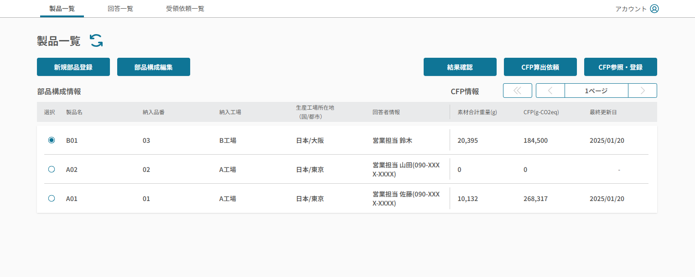
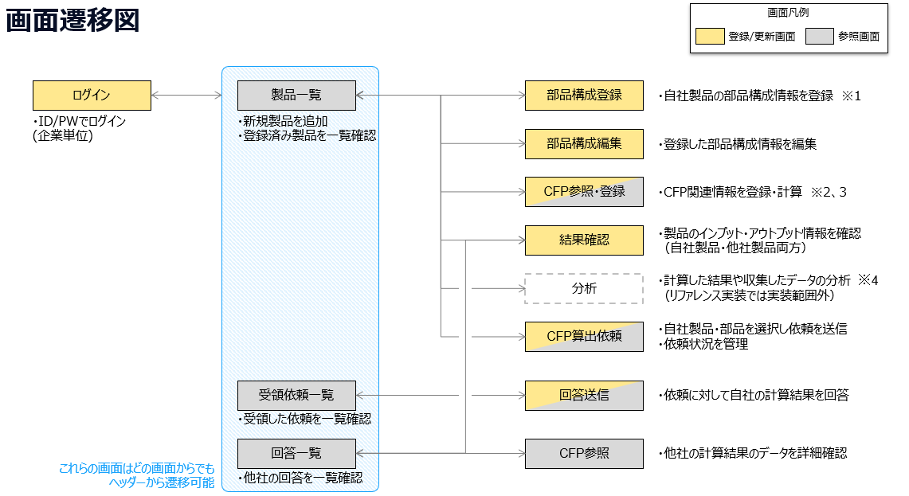
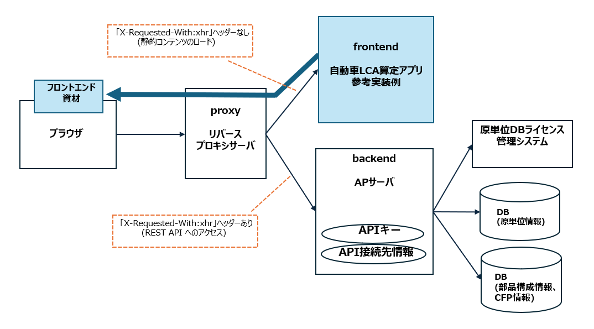

<!-- code_chunk_output -->

# 自動車LCA算定アプリ参考実装例

当リポジトリは、自動車ライフサイクルアセスメント（以下 自動車LCA）算定を利用するためのフロントエンドアプリケーションの実装例を、OSSとして公開したものである。

- [背景と目的](#背景と目的)
  - [画面遷移](#画面遷移)
  - [アプリケーション構成](#アプリケーション構成)
  - [ディレクトリ構成とレイヤ](#ディレクトリ構成とレイヤ)
- [前提とする環境](#前提とする環境)
  - [アプリケーション実行環境](#アプリケーション実行環境)
- [起動手順](#起動手順)
  - [リポジトリのクローン](#リポジトリのクローン)
  - [ローカル環境での起動](#ローカル環境での起動)
- [ビルド手順](#ビルド手順)
  - [アプリケーションのビルド](#アプリケーションのビルド)
- [ビルド後の実行](#ビルド後の実行)
- [テスト手順](#テスト手順)
  - [単体テストの実行](#単体テストの実行)
- [コーディング規約](#コーディング規約)
- [問合せ及び要望に関して](#問合せ及び要望に関して)
- [ライセンス](#ライセンス)
- [免責事項](#免責事項)

<a id="背景と目的"></a>

## 背景と目的

自動車産業の今後のレジリエンスや競争力強化の観点から、サプライチェーンにおける企業をまたいだデータ連携によるトレーサビリティ管理やサプライチェーンの強靭化のための実証として、それらを実現するシステムのプロトタイプが必要となった。

当アプリケーションは、部品構成登録、CFP登録、CFP算出依頼、CFP回答の機能を通じ、企業間のデータ共有を目的としている。

なお、当アプリケーションではデータ連携システムとの連携処理を実装していない。アプリケーションを開発する際には、実際のAPI仕様を参照して、連携部分の処理を実装する必要がある。

| 実行画面例                                           |
| :--------------------------------------------------- |
|  |

<a id="画面遷移"></a>

### 画面遷移

当アプリケーションの画面遷移を以下に示す。


※1～4は、リファレンス実装を参考にアプリケーションを開発する際に、各アプリケーションにおける考慮事項をまとめたものである。

- ※1：複数算定方法への対応
  - リファレンス実装は、[日本自動車工業会による自動車製品のカーボンフットプリントガイドライン（以降、JAMA CFPガイドライン）](https://www.jama.or.jp/operation/ecology/LCA/index.html)の算定方法をベースに実装しているが、それ以外の算定方法にも対応できることを念頭に置いて設計している。
  - 複数算定方法に対応する場合には「[複数算定方法に対応する場合の考え方](./docs/considerations.md#複数算定方法に対応する場合の考え方)」を参照のこと。
- ※2：原単位データの使用と依頼の依存関係
  - 原単位のサプライチェーンライセンスを使用する場合、準使用者は取引先企業からの依頼を受領した後に、特定の依頼に紐づけてのみ原単位を使用・CFP計算することができる。
  - リファレンス実装では実証活動推進の観点からその部分の制御を簡易的に実装しているため、各アプリケーションの実装においては「[原単位の使用可否と依頼の依存関係](./docs/considerations.md#原単位の使用可否と依頼の依存関係)」を参照のこと。
- ※3：CFP計算におけるデータ項目の設定値
  - JAMA CFPガイドラインに基づき、CFP計算におけるデータ項目とその設定値を「[自動車LCAアプリテストパターン](./docs/自動車LCAアプリテストパターン.xlsx)」にて整理している。
  - 一方、リファレンス実装の処理ロジックは、JAMA CFPガイドラインに基づいて作成されたツールをベースにしており、JAMA CFPガイドラインに記載のないプリセットや計算の仕組みを含んでいます。

- ※4：分析機能
  - 計算結果や取引先からの回答データを元に分析する機能については、リファレンス実装のスコープに含まれていない。
  - 競争領域の機能として求められると想定される分析の機能については、「[分析の機能一覧と計算ロジック](./docs/considerations.md#分析の機能一覧と計算ロジック)」を参照のこと。
<a id="アプリケーション構成"></a>

### アプリケーション構成

当アプリケーションは、Web UI (sample-application-lca-frontend, 以下 lca-frontend) およびリバースプロキシサーバ (sample-application-lca-proxy, 以下 lca-proxy) APサーバ (sample-application-lca-backend, 以下 lca-backend) の併用が前提となる。 本リポジトリでは lca-frontend を説明対象とし、lca-proxy と lca-backend は別のリポジトリで提供する。




- 自動車LCA算定アプリ参考実装例 (lca-frontend): 当アプリケーション

  - ブラウザは、当アプリケーションからフロントエンド資材をロードする。
  - 当アプリケーションからこれらの API へアクセスを行う際には、`X-Requested-With: xhr` ヘッダーが付与される。
  - リバースプロキシサーバ (lca-proxy) により `X-Requested-With: xhr` ヘッダーの有無で転送先を振り分ける。
  - API のエンドポイントと API キーの情報は、lca-backend アプリケーションが保持するため、当アプリケーション内での設定は行わない。

- リバースプロキシサーバ (lca-proxy)

  - ブラウザからのアクセス先となるリバースプロキシサーバである。
  - lca-frontend アプリケーションにて API アクセス時に付与される `X-Requested-With: xhr` ヘッダーの有無に応じて、振り分け転送を行う。
    - `X-Requested-With: xhr` ヘッダーが付与されていない場合: 自動車LCA算定アプリ参考実装例 (lca-frontend) へ転送する。
    - `X-Requested-With: xhr` ヘッダーが付与されている場合: AP サーバ (lca-backend) へ転送する。

- AP サーバ (lca-backend)

  - ブラウザからの API リクエストを処理し、DBに格納、またはDBから取得する。
  - 原単位DBライセンス管理システム API での認証後、DBから原単位情報を取得する。

<a id="ディレクトリ構成とレイヤ"></a>

### ディレクトリ構成とレイヤ
```
├── api               // API実装格納ディレクトリ
│   └── models        // APIのデータモデル定義
│   └── schemas       // API実装のためのinterface定義
├── app               // アプリケーションの機能やページのコンポーネントやロジック
├── components　　　　 // UIコンポーネント
├── fonts             // フォントファイル格納ディレクトリ
├── lib               // 共通のユーティリティ関数やライブラリ
│                     // （原単位DBを利用したLCA算定方法の計算処理はutils.tsに記載）
├── node_modules      // プロジェクトの依存関係格納ディレクトリ
├── out               // ビルド成果物格納されるディレクトリ
├── public            // 静的ファイル格納ディレクトリ
├── tests             // テストコード格納ディレクトリ
└── docs              // ドキュメント管理
```

<a id="前提とする環境"></a>

## 前提とする環境

<a id="アプリケーション実行環境"></a>

### アプリケーション実行環境

| ツール | バージョン |
| ------ | --------- |
| node   | 18.18.2   |
| npm    | 10.8.2    |

<a id="起動手順"></a>

## 起動手順

<a id="リポジトリのクローン"></a>

### リポジトリのクローン

当リポジトリのクローンを行う。

```sh
# 当リポジトリのクローン
git clone https://github.com/ouranos-ecosystem-idi/sample-application-lca-frontend.git lca-frontend
cd lca-frontend
```

<a id="ローカル環境での起動"></a>

### ローカル環境での起動

```sh
# パッケージのインストール
npm ci

# ローカル環境でのアプリケーションの起動
npm run dev
```

http://localhost:3000/ でアプリケーションが起動する。

<a id="ビルド手順"></a>

## ビルド手順

<a id="アプリケーションのビルド"></a>

### アプリケーションのビルド

当アプリケーションが lca-backend アプリケーションと正しく連携するには、
lca-backend のURL情報をファイル .env.local に指定する必要がある。
任意のエディタで .env.local を編集し、変数 `NEXT_PUBLIC_DATA_TRANSPORT_API_BASE_URL` の値に
lca-backend が公開しているURLのベース部分 (後半のパスを除いたもの) を指定する。
このとき、URL中のFQDNもしくはIPアドレスは、ユーザのブラウザから到達可能である必要がある。
記述例を以下に示す。

```
$ cat .env.local
NEXT_PUBLIC_DATA_TRANSPORT_API_BASE_URL=http://localhost
```

上記ファイルを編集したら、以下のコマンドでアプリケーションをビルドする。

```sh
# アプリケーションのビルド
npm run build
```

<a id="ビルド後の実行"></a>

## ビルド後の実行

ビルドされたアプリケーションは `out` ディレクトリ配下に作成される。これを任意の Web サーバーに配置し、Web ブラウザからアクセスすることで実行する。

```sh
# ビルドされたアプリケーションをWebサーバーのDocument rootディレクトリに配置
cp -r out/. <web_server_document_root_directory>
```

nginx を利用する場合に include 可能な設定サンプルは、`server.conf` に配置されている。

<a id="テスト手順"></a>

## テスト手順

<a id="単体テストの実行"></a>

### 単体テスト(jest)の実行

```sh
npm run test:unit

# (win) レポートを開く
start tests/unit/report.html

# (mac) レポートを開く
open tests/unit/report.html
```

<a id="コーディング規約"></a>

## コーディング規約

[SonarQube の 現時点の LTS 版 v9.9.2](https://www.sonarsource.com/products/sonarqube/downloads/lts/9-9-lts/) の Sonar way ルールを適用している。

<a id="問合せ及び要望に関して"></a>

## 問合せ及び要望に関して

- 本リポジトリは現状は主に配布目的の運用となるため、IssueやPull Requestに関しては受け付けておりません。

<a id="ライセンス"></a>

## ライセンス

- 本リポジトリはMITライセンスで提供されています。

<a id="免責事項"></a>

## 免責事項

- 本リポジトリの内容は予告なく変更・削除する可能性があります。
- 本リポジトリの利用により生じた損失及び損害等について、いかなる責任も負わないものとします。
