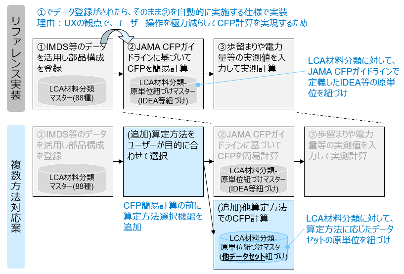

# アプリケーション開発時の考慮事項

ここでは、リファレンス実装を参考にアプリケーションを開発する場合に、考慮する必要がある事項を３点整理している。

## 複数算定方法に対応する場合の考え方

リファレンス実装は、部品構成登録とCFP計算を切り離すことで、JAMA CFPガイドラインだけでなく、複数の算定方法に対応できることを想定して設計している。

### 考え方

- 算定方法間で、共通的に使用する機能・固有性のある機能を切り離すことができれば、固有性のある部分を追加/修正することで、複数の方法に対応しやすいと考えられる。
  - 算定方法によらず共通的に使用しやすいデータ：部品構成データ
  - 方法の差異が生じやすいと考えられるデータ：CFPの計算データ（バウンダリや原単位のデータセットについては、方法論により定義が異なると想定される）
- 上記を踏まえると、部品構成データの登録・管理と、CFPの計算を、切り離して動かせるような設計にしておくことで、他の算定方法にも対応しやすいと考える。

### リファレンス実装における仕様と複数算定方法への対応案

リファレンス実装に対して、CFP算定方法の選択機能と、算定方法に応じたマスタデータを組み込むことで、複数算定方法対応を実現可能と考えている。

## 原単位の使用可否と依頼の依存関係

リファレンス実装は、IDEAのサプライチェーンライセンスの使用を前提としている。サプライチェーンライセンスを使用してCFP計算をするためには、使用者、ないし準使用者である必要があるため、CFP計算の前の段階でライセンス認証を実施する。

準使用者の場合には依頼があることが原単位利用の前提となるが、リファレンス実装では令和6年度の実証活動を推進するため、依頼がなくとも計算まで進めるように実装している。またユーザビリティを重視して、部品構成登録とCFPの簡易計算を一連の流れで実装したため、CFP計算の直前ではなく、部品構成登録の前にライセンス認証を実施している。

そのため、リファレンス実装を参考にアプリケーションを開発する場合、ライセンス認証機能は下記を考慮して実装することが求められる。

### アプリケーション実装時に原単位DBライセンス認証で考慮する仕様

| 仕様考慮観点 | リファレンス実装での仕様 | アプリケーションに求められる仕様 |
| ----------- | ---------------------- | ----------------------------- |
| ライセンス認証タイミング（使用者・準使用者） | 部品構成登録の前に認証 | サプライチェーンライセンスによる原単位の利用前に認証（多くはCFP計算の前と想定） |
| 使用者認証観点 | 使用者ライセンスを保持しているか | 使用者ライセンスを保持しているか |
| 準使用者認証観点 | 使用者ないし準使用者からの依頼があり、依頼の情報に基づいて認証をしているか | 使用者ないし準使用者からの依頼があり、依頼の情報に基づいて認証をしているか |
| ライセンスが確認できない場合の制御 | ライセンスがない旨をユーザーに通知するが、部品構成・CFP計算まで進むことが可能 | ライセンスがない旨をユーザーに通知し、当該機能を利用できないように制御 |

なお、原単位DBシステムのAPI仕様詳細については、**LicenseManagement_API_spec**を参照のこと。

## 分析の機能一覧と計算ロジック

ユーザーが作成したデータや取引先企業から受領したデータについては、インパクト分析や一次データに関する分析が求められる。令和6年度の実証活動において、分析の機能として想定される機能を整理した。

### 分析の機能一覧

自動車LCAデータ連携ガイドラインα版の「5.3.3 アプリケーションに要求するデータ連携関連機能」を参照のこと。

### 計算ロジック

上記機能に対して、設定方法とデータの参照先を整理した。

| 分析の機能 | 設定方法 | データ参照先(※1) |
| ----- | ----- | ----- |
| ①製品の排出量サマリー | 【CFP区分単位】排出量：CFP区分ごとの排出量 (kg-CO2eq)、 割合：CFP区分ごとの排出量 / ΣCFP区分ごとの排出量 * 100 (%) | ４）アウトプット・CFP情報 |
| ②対象範囲選択 | 部品構成ツリー：部品・材料構成における部品を上から順に並べ、構成品レベル１を左端とし、２，３と順番に一階層ずつ右にずらして配置 | ６）部品・材料構成情報 |
| ③部品別排出量 | 【部品単位】Σ当該部品に含まれる子部品や材料のCFP (kg-CO2eq)　※2 | ６）部品・材料構成情報、７）部品・材料単位CFP情報 |
| ④一次データ寄与率 | (1- ΣCFP区分ごとの排出量(実測・簡易) / ΣCFP区分ごとの排出量(合計) )*100 (%) 　※3 | ４）アウトプット・CFP情報 |
| ⑤一次データ計算比率 | Σ実測計算されたCFP区分ごとの排出量 / ΣCFP区分ごとの排出量 * 100 (%) | ７）部品・材料単位CFP情報 |
| ⑥材料別重量 | 【材料種別単位】材料別の重量 (g) | ２）インプット・材料情報 |
| ⑦材料別排出量 | 【材料種別単位】材料別の排出量 (kg-CO2eq) | ４）アウトプット・CFP情報 |
| ⑧エネルギー別排出量 | 【エネルギー種別単位】電力：ΣGHG排出_電力由来 (kg-CO2eq)、電力以外：エネルギー使用量(合計) * 排出係数 (kg-CO2eq) ※4 | ９）部品加工CFP計算情報、３）インプット・エネルギー情報 |
| ⑨エネルギ―別実測比率 | 【エネルギー種別単位】エネルギー使用量(実測) / エネルギー使用量(合計) * 100 (%) | ３）インプット・エネルギー情報 |

注釈
- ※1：自動車LCAデータ連携ガイドラインα版の付録４におけるエンティティを参照。
- ※2： 「当該部品に含まれる子部品や材料」とは、当該レコードから連なる、構成品レベルが自身より大きい数値のデータを意味する。自レコードから順に下っていき、自分と同じ、もしくは自分より構成品レベルが小さいレコードが登場するまでを合算する。
- ※3： 「ΣCFP区分ごとの排出量(実測・簡易)」とは、CFP区分ごとに実測分があればそれを合算し、実測がなければ簡易分を合算するものとする。
- ※4：電力は部品/材料で排出係数が異なるため、部品/材料毎の排出量を合算。電力以外はインプット情報でエネルギー種別毎に使用量が集計されているため、それと排出係数を乗算。